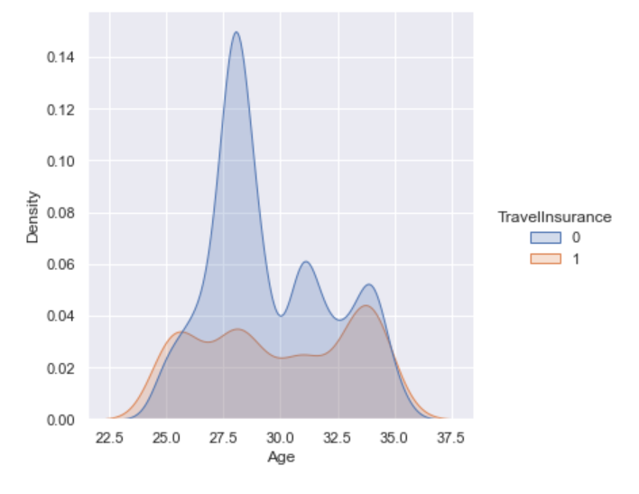
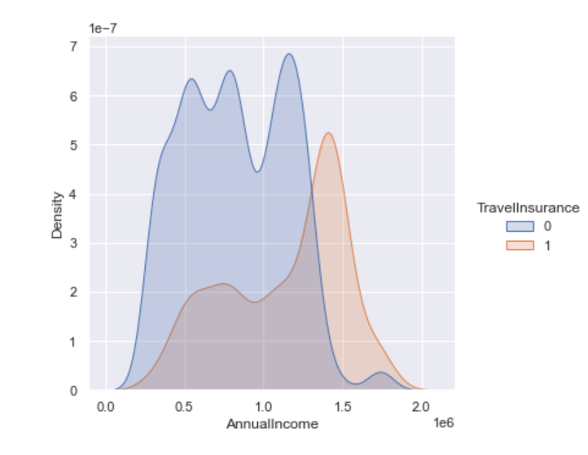
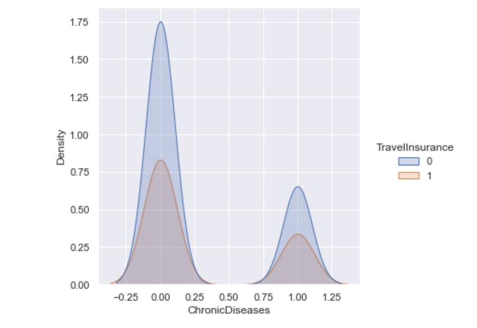
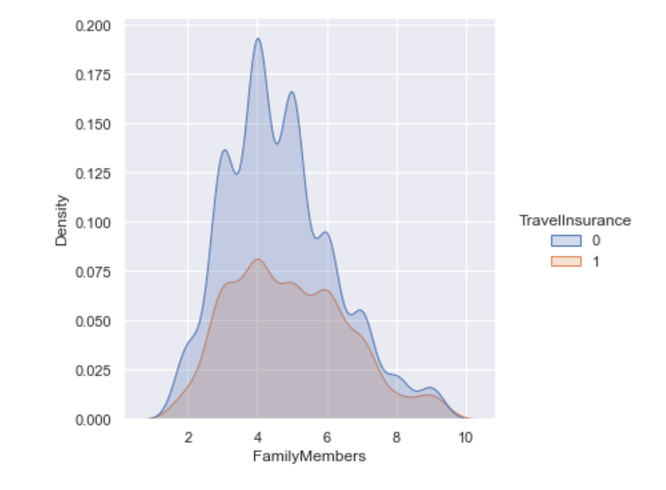
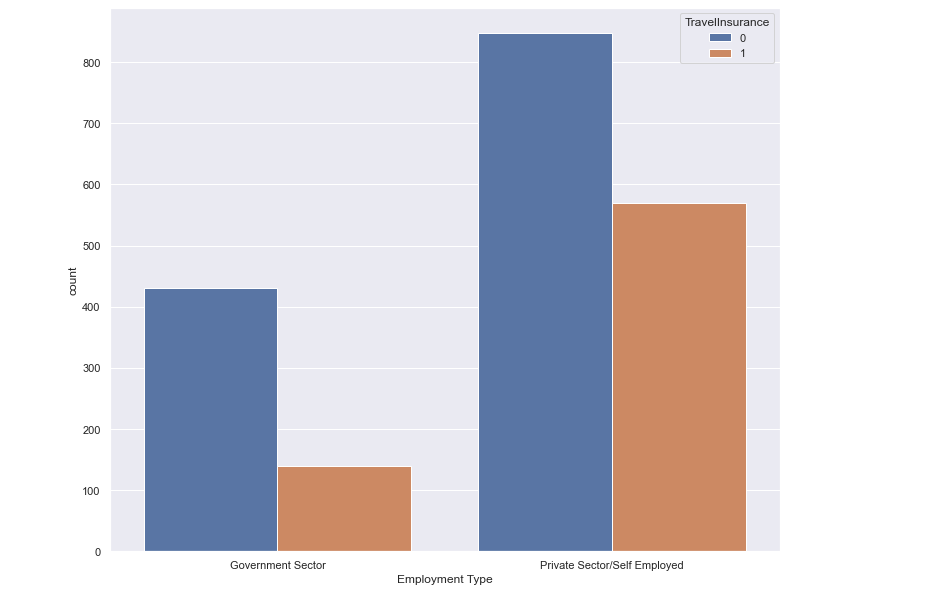
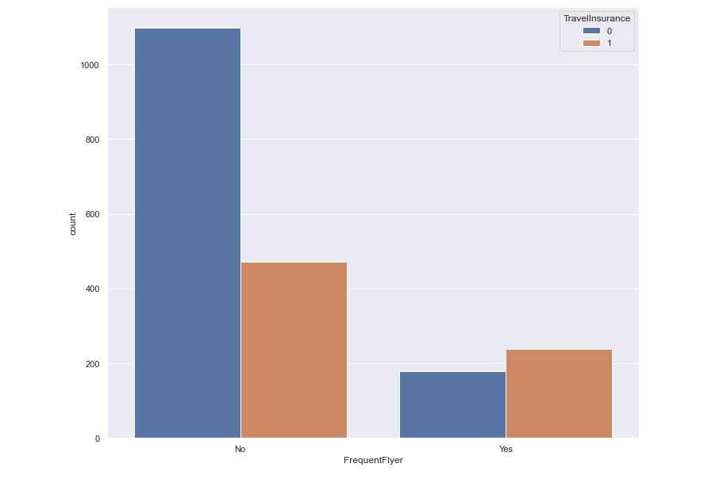
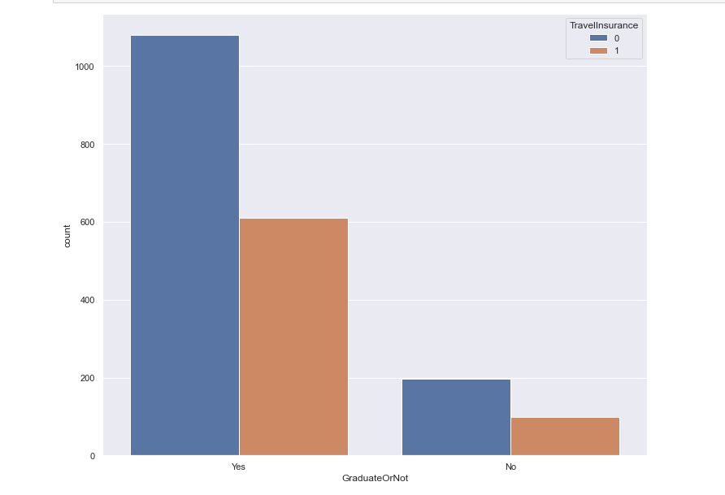
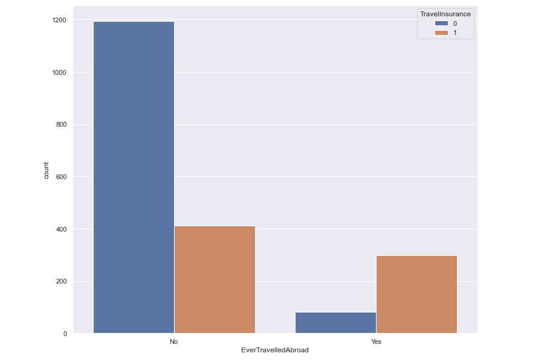
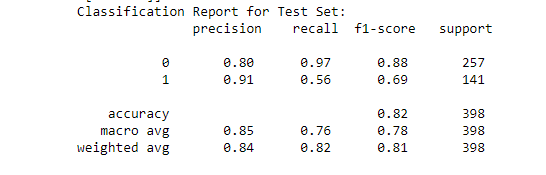
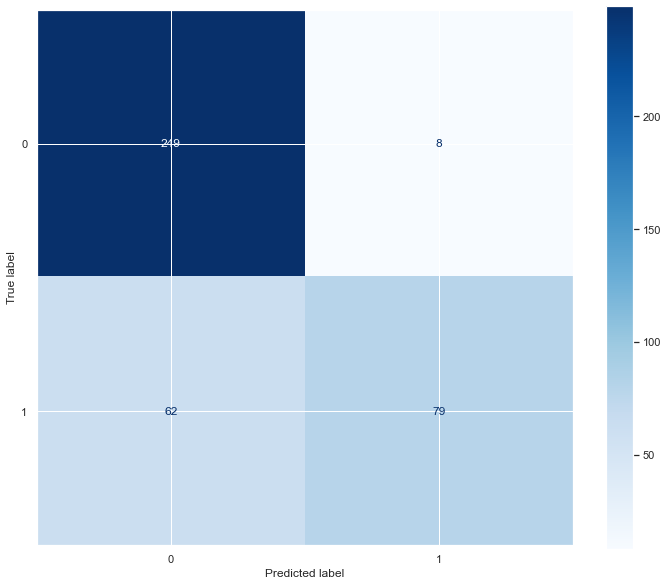

# Travel Insurance Predictor 
## Author: Naomi Weinberger 

## Overview
This project analyzed the  costumer base of a travel insurance company. In 2019 the company offered an introductory offer to previous costumers and collected data about said costumers including: age, employment type, whether or no the customer is a college graduate, annual income, number of family members, whether or not the costumer suffers from a chronic disease, whether or not the costumer is a frequent flier, whether or not the costumer took advantage of the introductory offer.

## Business Problem 
The goal was to predict whether or not a previous costumer would be interested in buying this company's newest package.

## Data
This dataset has an imbalanced class size with a 65/35 split, favoring those who did not buy insurance. Though the overall trend was to not buy, there were a number of exceptions to this. Costumers over 33, costumers who are frequent fliers, and those with an income over 1,350,000 Indian Rupees were more likely to buy travel insurance than not to. 

## Models and Results 
The model went through many iterations in order to maximize its strength in correctly classifying the costumer into either the  "will buy" or "will not buy" catergory. The final model was a XGBoost model that utilized SMOTE to accont for the class imbalance. The model also used a gridsearch to find the most optimal hyperparameters for the data. The model used an Alpha of 0.1, a learning rate or 0.1 and a max depth of 5. The model has a F1 score of .88. A look at the feature importance of the model showed that each of the features proved to be useful in predicting the target. 

## Conclusions and Next Steps 
 1. Target those costumers in the four groups listed aboved (Costumers over 33, costumers who are frequent fliers, and those with an income over 1,350,000 Indian Rupees were more likely to buy travel insurance than not to.)
2. Create a survery to help determine why many costumers chose not to renew their policies.
3. Analyze the claims submitted/ claims covered to be able to be more transparent with the costumers, thereby gaining their trust. 

## For More Information
Please see full [repository](https://github.com/Naomiweinberger?tab=repositories) or email weinberger.naomi@gmail.com for more information.
Here is the [presentation](https://docs.google.com/presentation/d/1yRMsyjeEJwbr7DuavZnvbP1pw-BKqvEfpvpIKr17HVw/edit#slide=id.geae368313a_0_70) for this project. 

